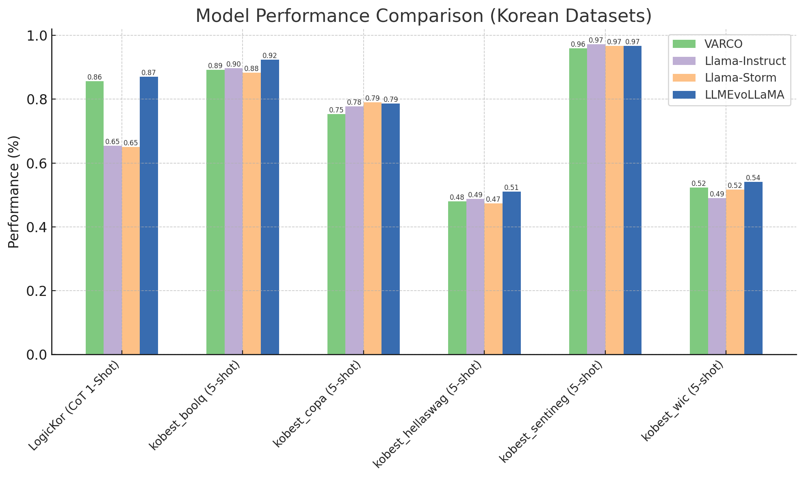

# 🤖 LLM Evolutionary Merge

🤗 [Model](https://huggingface.co/fiveflow/LLMEvoLLaMA-3.1-8B-v0.1) | 📂 [Github](https://github.com/kwon13/LLM-Evo-Merge) | ✍️ [Blog](작성중..) | 💡[Inspired by Sakana AI](https://github.com/SakanaAI/evolutionary-model-merge)


This project aims to optimize model merging by integrating LLMs into evolutionary strategies in a novel way. Instead of using the [CMA-ES](https://en.wikipedia.org/wiki/CMA-ES) approach, the goal is to improve model optimization by [leveraging the search capabilities of LLMs](https://arxiv.org/abs/2402.18381) to explore the parameter space more efficiently and adjust the search scope based on high-performing solutions.

Currently, the project supports optimization only within the Parameter Space, but I plan to extend its functionality to enable merging and optimization in the Data Flow Space as well. This will further enhance model merging by optimizing the interaction between data flow and parameters.

## Performance
I focused on creating a high-performing Korean model solely through merging, without additional model training.
<details>
<summary>Merging Recipe</summary>

```YAML
base_model: meta-llama/Llama-3.1-8B
dtype: bfloat16
merge_method: task_arithmetic
allow_negative_weights: true
parameters:
  int8_mask: 1.0
  normalize: 1.0
slices:
- sources:
  - layer_range: [0, 2]
    model: NCSOFT/Llama-VARCO-8B-Instruct
    parameters:
      weight: 1
  - layer_range: [0, 2]
    model: akjindal53244/Llama-3.1-Storm-8B
    parameters:
      weight: 0.3475802891062396
  - layer_range: [0, 2]
    model: meta-llama/Llama-3.1-8B

- sources:
  - layer_range: [2, 4]
    model: NCSOFT/Llama-VARCO-8B-Instruct
    parameters:
      weight: 0.8971381657317269
  - layer_range: [2, 4]
    model: akjindal53244/Llama-3.1-Storm-8B
    parameters:
      weight: 0.45369921781118544
  - layer_range: [2, 4]
    model: meta-llama/Llama-3.1-8B

- sources:
  - layer_range: [4, 6]
    model: NCSOFT/Llama-VARCO-8B-Instruct
    parameters:
      weight: 0.5430828084884667
  - layer_range: [4, 6]
    model: akjindal53244/Llama-3.1-Storm-8B
    parameters:
      weight: 0.2834723715836387
  - layer_range: [4, 6]
    model: meta-llama/Llama-3.1-8B

- sources:
  - layer_range: [6, 8]
    model: NCSOFT/Llama-VARCO-8B-Instruct
    parameters:
      weight: 0.419043948030593
  - layer_range: [6, 8]
    model: akjindal53244/Llama-3.1-Storm-8B
    parameters:
      weight: 0.3705268601566145
  - layer_range: [6, 8]
    model: meta-llama/Llama-3.1-8B

- sources:
  - layer_range: [8, 10]
    model: NCSOFT/Llama-VARCO-8B-Instruct
    parameters:
      weight: 0.3813333860404775
  - layer_range: [8, 10]
    model: akjindal53244/Llama-3.1-Storm-8B
    parameters:
      weight: 0.7634501436288518
  - layer_range: [8, 10]
    model: meta-llama/Llama-3.1-8B

- sources:
  - layer_range: [10, 12]
    model: NCSOFT/Llama-VARCO-8B-Instruct
    parameters:
      weight: 0.49134830660275863
  - layer_range: [10, 12]
    model: akjindal53244/Llama-3.1-Storm-8B
    parameters:
      weight: 0.7211994938499454
  - layer_range: [10, 12]
    model: meta-llama/Llama-3.1-8B

- sources:
  - layer_range: [12, 14]
    model: NCSOFT/Llama-VARCO-8B-Instruct
    parameters:
      weight: 0.9218963071448836
  - layer_range: [12, 14]
    model: akjindal53244/Llama-3.1-Storm-8B
    parameters:
      weight: 0.5117022419864319
  - layer_range: [12, 14]
    model: meta-llama/Llama-3.1-8B

- sources:
  - layer_range: [14, 16]
    model: NCSOFT/Llama-VARCO-8B-Instruct
    parameters:
      weight: 0.8238938467581831
  - layer_range: [14, 16]
    model: akjindal53244/Llama-3.1-Storm-8B
    parameters:
      weight: 0.851712316016478
  - layer_range: [14, 16]
    model: meta-llama/Llama-3.1-8B

- sources:
  - layer_range: [16, 18]
    model: NCSOFT/Llama-VARCO-8B-Instruct
    parameters:
      weight: 0.3543028846914006
  - layer_range: [16, 18]
    model: akjindal53244/Llama-3.1-Storm-8B
    parameters:
      weight: 0.6864368345788241
  - layer_range: [16, 18]
    model: meta-llama/Llama-3.1-8B

- sources:
  - layer_range: [18, 20]
    model: NCSOFT/Llama-VARCO-8B-Instruct
    parameters:
      weight: 0.9189961100847883
  - layer_range: [18, 20]
    model: akjindal53244/Llama-3.1-Storm-8B
    parameters:
      weight: 0.5800251781306379
  - layer_range: [18, 20]
    model: meta-llama/Llama-3.1-8B

- sources:
  - layer_range: [20, 22]
    model: NCSOFT/Llama-VARCO-8B-Instruct
    parameters:
      weight: 0.9281691677008521
  - layer_range: [20, 22]
    model: akjindal53244/Llama-3.1-Storm-8B
    parameters:
      weight: 0.5356892784211416
  - layer_range: [20, 22]
    model: meta-llama/Llama-3.1-8B

- sources:
  - layer_range: [22, 24]
    model: NCSOFT/Llama-VARCO-8B-Instruct
    parameters:
      weight: 0.839268407952539
  - layer_range: [22, 24]
    model: akjindal53244/Llama-3.1-Storm-8B
    parameters:
      weight: 0.5082186376599986
  - layer_range: [22, 24]
    model: meta-llama/Llama-3.1-8B

- sources:
  - layer_range: [24, 26]
    model: NCSOFT/Llama-VARCO-8B-Instruct
    parameters:
      weight: 0.6241902192095534
  - layer_range: [24, 26]
    model: akjindal53244/Llama-3.1-Storm-8B
    parameters:
      weight: 0.2945221540685877
  - layer_range: [24, 26]
    model: meta-llama/Llama-3.1-8B

- sources:
  - layer_range: [26, 28]
    model: NCSOFT/Llama-VARCO-8B-Instruct
    parameters:
      weight: 0.7030728026501202
  - layer_range: [26, 28]
    model: akjindal53244/Llama-3.1-Storm-8B
    parameters:
      weight: 0.2350478509634181
  - layer_range: [26, 28]
    model: meta-llama/Llama-3.1-8B

- sources:
  - layer_range: [28, 30]
    model: NCSOFT/Llama-VARCO-8B-Instruct
    parameters:
      weight: 0.2590342230366074
  - layer_range: [28, 30]
    model: akjindal53244/Llama-3.1-Storm-8B
    parameters:
      weight: 0.006083182855312869
  - layer_range: [28, 30]
    model: meta-llama/Llama-3.1-8B

- sources:
  - layer_range: [30, 32]
    model: NCSOFT/Llama-VARCO-8B-Instruct
    parameters:
      weight: 1
  - layer_range: [30, 32]
    model: akjindal53244/Llama-3.1-Storm-8B
    parameters:
      weight: 0.234650395825126
  - layer_range: [30, 32]
    model: meta-llama/Llama-3.1-8B
```
</details>

The models used for merging are listed below.
```
Base Model: meta-llama/Llama-3.1-8B
Model 1: NCSOFT/Llama-VARCO-8B-Instruct
Model 2: akjindal53244/Llama-3.1-Storm-8B
```
### Comparing LLMEvoLlama with Source in Korean Benchmark

- LogicKor: A benchmark that evaluates various linguistic abilities in Korean, including math, writing, coding, comprehension, grammar, and reasoning skills. (https://lk.instruct.kr/)

- KoBest: A benchmark consisting of five natural language understanding tasks designed to test advanced Korean language comprehension. (https://arxiv.org/abs/2204.04541)

### Comparing LLMEvoLlama with Source in English Benchmark and Total Average
| Model           | truthfulqa_mc2 (0-shot acc) | arc_challenge (0-shot acc) | Korean + English Performance (avg) |
|-----------------|-------------------------|------------------------|------------------------------|
| [VARCO](https://huggingface.co/NCSOFT/Llama-VARCO-8B-Instruct)           | 0.53                  | 0.47                 | 0.68                         |
| [Llama-Instruct](https://huggingface.co/meta-llama/Llama-3.1-8B-Instruct)  | 0.53                  | 0.52                 | 0.66                         |
| [Llama-Storm](https://huggingface.co/akjindal53244/Llama-3.1-Storm-8B)     | 0.59                  | 0.52                 | 0.67                         |
| [LLMEvoLLaMA](https://huggingface.co/fiveflow/LLMEvoLLaMA-3.1-8B-v0.1)     | 0.57                  | 0.50                 | **0.71**                         |

## Installation
Install LLM-Evo-Merge with the evolve (and optionally vllm) features:
```
git clone https://github.com/kwon13/LLM-Evo-Merge.git
cd LLM-Evo-Merge
pip install -e .[evolve,vllm]
```

## Configuration

LLM-Evo-Merge takes in a YAML configuration file that defines how the merge is parameterized and what metrics to optimize. The general syntax is as follows:

```yml
genome:
    models:
       - model_1
       - model_2
       ...
       - model_n
    merge_method: dare_ties
    base_model: base_model_if_needed
    tokenizer_source: null # optional
    layer_granularity: 8

    # optional:
    normalize: false
    allow_negative_weights: false
    smooth: false
    filters: ...
tasks:
  - name: lm_eval_task_name
    weight: 1.0 # optional
    metric: "acc,none" # defaults to acc,none
  - name: ... # as many as you want
```

### Genome Definition

The `genome` section of the configuration file defines the parameter space that `mergekit-evolve` will be optimizing in.

#### `models`

This should be a list of all of the models you want available to be merged. Depending on the merge method not all are guaranteed to be used in the final merge.

#### `merge_method`

Merge method to be used. Currently supported values are `linear`, `dare_ties`, `task_arithmetic`, `ties`, and `slerp`.

#### `base_model`

The base model for the merge, if applicable.

#### `layer_granularity`

A set of parameters will be introduced for each consecutive slice of `layer_granularity` layers. So for example, a 32-layer model like `mistralai/Mistral-7B-v0.1` with `layer_granularity: 8` will be divided into 4 groups of 8 layers with different merge parameters for each. The value specified here must be a divisor of the number of layers in your input models. Large values of `layer_granularity` will reduce the search space greatly, meaning you will get faster convergence at the cost of a potentially less good global solution.

When not set, one set of parameters will be used for all layers.

#### `normalize`

Sets the `normalize` flag when merging. For methods like `linear`, `ties`, and `dare_ties` this constrains the search space to a set of definitely valid models. Similarly to `layer_granularity`, this can greatly speed up convergence at the cost of ruling out oddball solutions that might score better than more standard merges.

#### `allow_negative_weights`

Pretty self explanatory. When this flag is not set, the absolute value of weight parameters is used. Sensible search space reduction for `linear` and `slerp`. For task arithmetic based methods you probably want `allow_negative_weights: true`.

#### `smooth`

If set to `true`, then parameter values will be interpolated across layers instead of assigning a single, fixed value to each block.

#### `filters`

Accepts a list of filters, as in `mergekit-yaml`, by which to separate the parameters. So, for example, setting filters as below for a Llama-based merge:

```yaml
filters:
  - self_attn
  - mlp
```

Will divide up the merge parameters into three groups - self attention parameters, MLP parameters, and a third for everything else. Separating the parameters out like this can be very beneficial when merging models trained on different prompt formats. It also makes your parameter space three times as big though!

### Task Definition

To evaluate the produced merges you need to specify a list of tasks supported by the EleutherAI LM evaluation harness. This can be either [built in tasks](https://github.com/EleutherAI/lm-evaluation-harness/tree/main/lm_eval/tasks) (don't be naughty) or tasks you define yourself (see the [New Task Guide](https://github.com/EleutherAI/lm-evaluation-harness/blob/main/docs/new_task_guide.md) for how). If your task does not use `acc` as the metric then you must specify the correct metric name. Each task can also optionally have a weight associated.

`mergekit-evolve` aims to maximize the score of the merge, so if you are using any tasks or metrics where a lower score is better (like perplexity) be sure to assign a negative weight to that task.

## Running `mergekit-evolve`

```sh
mergekit-evolve [OPTIONS] --storage-path PATH GENOME_CONFIG_PATH
```

`mergekit-evolve` needs a storage path specified, where it will save the input models, merges to evaluate, and the config for the current best merge evaluated. If you are not using in-memory merging this can require a _lot_ of space - expect at least one fp16 model per GPU.

Some important options:

### Scheduling Strategy (`--strategy`)

There are three different strategies implemented for scheduling merging and evaluation jobs.

#### `pool`

Assigns an actor to each GPU in your cluster and guarantees merges and evaluations are performed on the same node. This is a safe default suitable for any configuration, local or distributed.

#### `buffered`

Maintains a buffer of tasks scheduled to ensure that there is always a model mergign or ready to evaluate for each gpu. Allows for concurrent merging and evaluation of models on the same GPU if enough VRAM is available. Only suitable for a single-node setup or when `--storage-path` points to a fast shared filesystem.

#### `serial`

Uses Ray placement groups to ensure merges and their evaluations happen on the same node, but otherwise just lets Ray take the wheel. Maybe give a try if you're having trouble with the other two, otherwise probably don't use it.

### Evaluation LLM Backend

By default `mergekit-evolve` will use the `hf` backend for `lm-eval`. To use vLLM instead, pass the `--vllm` flag.

### On-Disk vs. In-Memory

By default `mergekit-evolve` will perform merges, write the result to disk, then start up an instance of lm-eval pointing at that path. This is a safe default and will generally always work but also causes a lot of GPU downtime and eats disk space. When using the `pool` scheduling strategy, you have the option to instead keep a model resident in memory and directly update its parameters instead of merging to disk. This is much faster and uses no additional disk space. However, it does involve mucking around in the internals of vLLM and the LM evaluation harness. So it might break at any moment! Choose wisely. Use `--in-memory` to enable this mode.

### Task search path

If you're using custom task definitions (and you should be) then you can append to the search path using the `--task-search-path` option. This should point to the directory your custom task YAML is in (or a parent of that directory). Multiple paths can be included by repeating the option.

### Batch size

Override the batch size used during merge evaluation. If using vLLM `auto` is recommended (default).

### LLM Evo options

#### `--max-generation`

max-generation: This option sets the maximum number of generations the algorithm will evolve. Once this value is reached, the algorithm stops further evolution and returns the best result. A higher value allows the algorithm to explore more generations and improve performance, but it increases computation cost. Default: 10

#### `--sigma-low`

This option sets the mutation strength applied when the fitness score improves. A lower value enables more fine-tuned exploration within a smaller range, allowing for precise adjustments based on already successful solutions. Setting a lower value helps with gradual optimization without excessive changes. Default: 0.05

#### `--sigma-high`

This option sets the mutation strength applied when the fitness score does not improve. A higher value allows for broader exploration in case the current solution is stagnating, making it easier to discover new possibilities. While a higher value broadens the search space, it may introduce larger changes. Default: 0.2

#### `--max-retries`

The number of retries when an error occurs during an API call.

#### `--api-key`

The authentication key used to access the OpenAI API.

#### `--llm-model`

The name of the LLM model to be used from OpenAI's available models.


### WandB logging

`llm_evo` supports logging metrics to Weights & Biases. Enable this functionality with the `--wandb` flag. Project and entity names can be overridden with the `--wandb-project` and `--wandb-entity` options.

### Example

```sh
python3 ./mergekit/scripts/llm_evo.py --strategy pool --wandb --wandb-project mergekit-evolve --wandb-entity arcee-ai --storage-path /path/to/mergekit-evolve/ ./config.yml
```

## Acknowledgement
I would like to express my gratitude to Sakana AI for inspiring me with their intriguing ideas. My code was built upon the Mergekit repository, and I sincerely thank the developers for their efforts throughout the process.


## Citation

```bibtex
@article{goddard2024arcee,
  title={Arcee's MergeKit: A Toolkit for Merging Large Language Models},
  author={Goddard, Charles and Siriwardhana, Shamane and Ehghaghi, Malikeh and Meyers, Luke and Karpukhin, Vlad and Benedict, Brian and McQuade, Mark and Solawetz, Jacob},
  journal={arXiv preprint arXiv:2403.13257},
  year={2024}
}

@misc{lange2024largelanguagemodelsevolution,
  title={Large Language Models As Evolution Strategies}, 
  author={Robert Tjarko Lange and Yingtao Tian and Yujin Tang},
  year={2024},
  eprint={2402.18381},
  archivePrefix={arXiv},
  primaryClass={cs.AI},
  url={https://arxiv.org/abs/2402.18381}, 
}

@misc{akiba2024evolutionaryoptimizationmodelmerging,
      title={Evolutionary Optimization of Model Merging Recipes}, 
      author={Takuya Akiba and Makoto Shing and Yujin Tang and Qi Sun and David Ha},
      year={2024},
      eprint={2403.13187},
      archivePrefix={arXiv},
      primaryClass={cs.NE},
      url={https://arxiv.org/abs/2403.13187}, 
}
```
